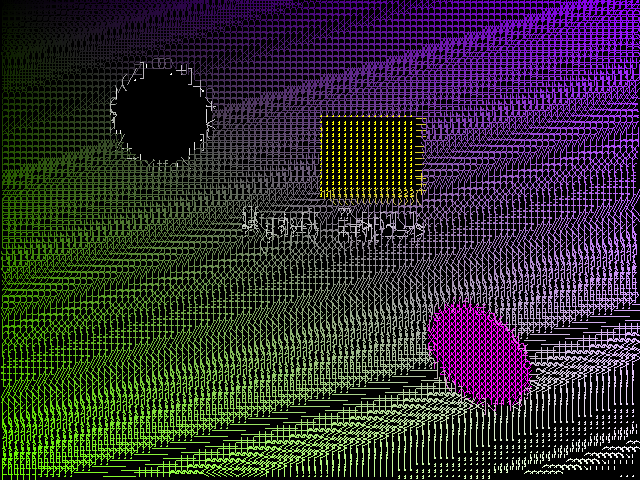

# 🎨 PyArt - Turn Your Webcam Into Art

Hey there! This is PyArt - a project I've been working on that turns your boring webcam feed into some pretty cool visual art. Started this during a hackathon and it's grown into something way more than I originally planned.

Basically, it takes your live video and applies all sorts of trippy effects - ASCII art, kaleidoscope patterns, edge detection, you name it. You can control everything with hand gestures (which is surprisingly fun) or voice commands if you're feeling fancy.



---

## What it does

### The main stuff:
- **20+ live effects** - ASCII art, edge detection, kaleidoscope, that psychedelic thing that makes you look like you're in the 60s
- **Face tracking** - finds your face and can highlight it, pixelate it, or slap emojis on it (surprisingly entertaining)
- **Hand gestures** - thumbs up/down to change effects, peace sign for screenshots, etc. No touching required!
- **Voice commands** - say "next effect" or "take picture" and it actually works (most of the time)
- **Motion trails** - wave your hand around and leave cool trails behind
- **Split screen** - see before/after side by side
- **Night vision mode** - because why not

### The practical stuff:
- Take photos and record videos of your art
- Convert existing images to ASCII art 
- Time-lapse recording for those satisfying transformation videos
- Works with multiple cameras if you have them

---

## Getting it running

### You'll need:
- Python 3.8 or newer (3.9+ recommended)
- A webcam (obviously)
- Internet connection if you want voice commands

### Installation (the easy way):

**Windows users:**
Just double-click `setup.bat` and it should handle everything for you.

**Mac/Linux users:**
Run `./setup.sh` or follow the manual steps below.

### Manual installation:

1. **Grab the code:**
```bash
git clone https://github.com/Sifee27/PyArt.git
cd PyArt
```

2. **Install the dependencies:**
```bash
pip install -r requirements.txt
```

3. **For voice commands (optional but fun):**
```bash
pip install SpeechRecognition pyaudio
```
Note: pyaudio can be a pain on some systems. If it fails, just skip it - everything else will still work.

### 🎬 How to run it

**The easy way:**
```bash
python launcher.py
```
This gives you a nice menu with options for everything.

**Quick start scripts:**

- **Windows people:** Just double-click `run_pyart.bat`
- **Mac/Linux folks:** Run `./run_pyart.sh` (you might need to `chmod +x run_pyart.sh` first)

**If you're feeling direct:**
```bash
python main.py                    # Normal mode
python main.py --voice           # Voice commands enabled
python file_converter.py         # Just the file converter
```

**First time setup:**
Run `python test_installation.py` if you want to make sure everything's working properly.

## 🎮 How to use it

### ⌨️ **Keyboard shortcuts**
| Key | What it does |
|-----|--------|
| `SPACE` | Next effect |
| `B` | Previous effect |
| `S` | Take snapshot |
| `R` | Start/stop recording |
| `+/-` | Adjust effect intensity |
| `M` | Mirror/flip video |
| `H` | Toggle help overlay |
| `F` | Toggle face tracking |
| `E` | Cycle face effects |
| `Q` | Quit application |

### ✋ **Hand Gestures** (When enabled)
| Gesture | Action |
|---------|--------|
| 👍 Thumbs Up | Next effect |
| 👎 Thumbs Down | Previous effect |
| ✌️ Peace Sign | Take snapshot |
| ✊ Closed Fist | Start/stop recording |
| 🖐️ Open Palm | Pause/resume |

### 🗣️ **Voice Commands** (When enabled)
| Command | Action |
|---------|--------|
| "Next effect" | Switch to next filter |
| "Take picture" | Capture snapshot |
| "Start recording" | Begin video recording |
| "Night vision" | Toggle night mode |
| "Face tracking" | Enable face detection |
| "Show help" | Display controls |

---

## 🛠️ System Requirements

- **Operating System**: Windows 10+, macOS 10.14+, or Linux (Ubuntu 18.04+)
- **Python**: 3.8 or higher
- **RAM**: 4GB minimum, 8GB recommended
- **Webcam**: Any USB webcam or built-in camera
- **Microphone**: Required for voice commands (optional feature)

---

## 📂 Project Structure

```
PyArt/
├── launcher.py              # Interactive application launcher
├── main.py                 # Main application with all features
├── file_converter.py       # Standalone file conversion tool
├── requirements.txt        # Python dependencies
├── README.md              # This file
├── 
├── run_pyart.bat/.sh      # Quick launch scripts
├── run_pyart_voice.bat/.sh # Launch with voice commands
├── run_converter.bat/.sh   # Launch file converter
├── 
├── src/                   # Source code modules
│   ├── effects.py         # Visual effects and filters
│   ├── ui.py             # User interface and overlays
│   ├── voice_commands.py  # Voice recognition system
│   ├── gesture_control.py # Hand gesture recognition
│   ├── emoji_generator.py # Emoji overlay system
│   └── file_operations.py # File I/O operations
├── 
├── assets/               # Assets and resources
│   └── emojis/          # Generated emoji images
├── 
├── saved_images/        # Output folder for captures
├── docs/               # Documentation and examples
└── config.json         # Configuration settings
```

---

## 🔧 Configuration

PyArt includes a `config.json` file for customizing settings:

```json
{
    "default_effect": "ascii_simple",
    "gesture_sensitivity": 0.7,
    "voice_enabled": false,
    "auto_save": true,
    "video_quality": "high"
}
```

---

## 😅 When things go wrong

### Stuff that usually breaks

**"No camera detected"**
- Make sure your webcam isn't being hogged by another app (looking at you, Zoom)
- Run `python test_installation.py` to see what's up

**Voice commands being ignored**
- You need: `pip install SpeechRecognition pyaudio`
- Check if your mic is actually working (system settings)
- Voice recognition needs internet (uses Google's servers)

**Everything's running like molasses**
- Press `-` to lower the effect intensity
- Close Chrome (it's probably using all your RAM anyway)
- Try simpler effects like "edge_detection" instead of the fancy ones

**Random install errors**
- Try: `python -m pip install --upgrade pip`
- Install Microsoft Visual C++ Redistributable (Windows)
- Use Python 3.8-3.11 (some packages may not support newer versions)

### Getting Help

1. **Run the installation test**: `python test_installation.py`
2. **Check system info**: Choose option 6 in the launcher
3. **View detailed help**: Press `H` in the application
4. **Open an issue**: [GitHub Issues](https://github.com/yourusername/PyArt/issues)

---

## 🚀 Advanced Usage

### Custom Effects
Create your own effects by adding functions to `src/effects.py`:

```python
def my_custom_effect(self, frame):
    # Your effect code here
    return processed_frame
```

### Batch Processing
Convert multiple files using the file converter:
```bash
python file_converter.py --batch input_folder/ output_folder/
```

### Recording Settings
Adjust recording quality in `config.json` or launcher settings menu.

---

## 🤝 Contributing

We welcome contributions! Here's how to get started:

1. Fork the repository
2. Create a feature branch: `git checkout -b feature-name`
3. Make your changes and test thoroughly
4. Submit a pull request with a clear description

### Development Setup
```bash
git clone https://github.com/yourusername/PyArt.git
cd PyArt
pip install -r requirements.txt
python test_installation.py  # Verify setup
```

---

## 📝 License

This project is licensed under the MIT License - see the [LICENSE](LICENSE) file for details.

---

## 🙏 Acknowledgments

- **OpenCV** community for computer vision tools
- **MediaPipe** for advanced hand tracking
- **SpeechRecognition** library for voice commands
- **Hack Club** for inspiration and community

---

## 📞 Support

- **Documentation**: Check the `docs/` folder for detailed guides
- **Issues**: Report bugs on [GitHub Issues](https://github.com/yourusername/PyArt/issues)
- **Discussions**: Join our community discussions

---

**Built with ❤️ for creative coding and computer vision enthusiasts!**
